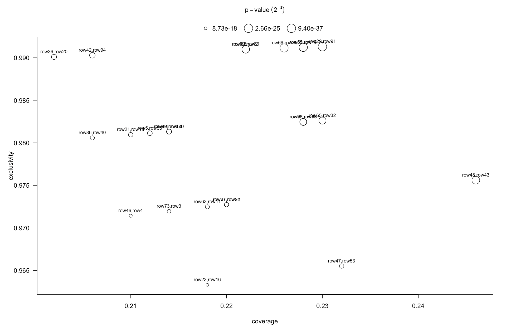

rmemod
====

Discovering functional modules by identifying recurrent and mutually exclusive
mutational patterns in tumors.

A method that identifies functional modules without any information other than
patterns of recurrent and mutually exclusive aberrations (RME patterns) that
arise due to positive selection for key cancer phenotypes.

The algorithm efficiently constructs and searches networks of potential
interactions and identifies significant modules (RME modules) by using the
algorithmic significance test.

---

to install:

```r
# install.packages('devtools')
devtools::install_github('raredd/rmemod')
```

## basic usage

```r
set.seed(1)
x <- matrix(rbinom(1000 * 50, 1, 0.1), 100)
r <- rmemod(x)
r
```

```
#            d coverage exclusivity       module      p.value
# 1  119.67899    0.230   0.9913043  row29,row91 9.397942e-37
# 2  117.45709    0.228   0.9912281  row55,row14 4.384224e-36
# 3  117.44966    0.228   0.9912281  row89,row18 4.406850e-36
# 4  115.85324    0.226   0.9911504  row69,row26 1.332595e-35
# 5  111.13510    0.246   0.9756098  row48,row43 3.507528e-34
# 6  109.89769    0.222   0.9909910  row30,row80 8.269857e-34
# 7  109.65203    0.222   0.9909910   row85,row2 9.805073e-34
# 8  104.02766    0.230   0.9826087  row65,row32 4.836754e-32
# 9  102.98590    0.228   0.9824561  row97,row25 9.957584e-32
# 10 100.12729    0.228   0.9824561  row75,row82 7.222392e-31
# 11  87.43594    0.206   0.9902913  row42,row94 4.777060e-27
# 12  82.92589    0.202   0.9900990  row36,row20 1.088475e-25
# 13  80.96753    0.214   0.9813084  row81,row51 4.230047e-25
# 14  80.76647    0.214   0.9813084 row39,row100 4.862618e-25
# 15  79.10360    0.212   0.9811321   row5,row35 1.539728e-24
# 16  75.45662    0.210   0.9809524  row21,row13 1.928837e-23
# 17  74.62144    0.232   0.9655172  row47,row53 3.441197e-23
# 18  73.72374    0.220   0.9727273  row77,row54 6.411256e-23
# 19  72.88558    0.220   0.9727273  row61,row22 1.146180e-22
# 20  71.82390    0.206   0.9805825  row86,row40 2.392495e-22
# 21  71.18552    0.218   0.9724771  row63,row11 3.724109e-22
# 22  66.44203    0.214   0.9719626   row73,row3 9.975983e-21
# 23  60.42944    0.210   0.9714286   row46,row4 6.440594e-19
# 24  56.66844    0.218   0.9633028  row23,row16 8.731700e-18
```

```r
plot(r)
```




# References

Miller CA, SH Settle, EP Sulman, KD Aldape, A Milosavljevic. Discovering
functional modules relevant for cancer progression by identifying patterns of
recurrent and mutually exclusive aberrations in tumor samples.
_BMC Medical Genomics_ 2011, __4__:34.
